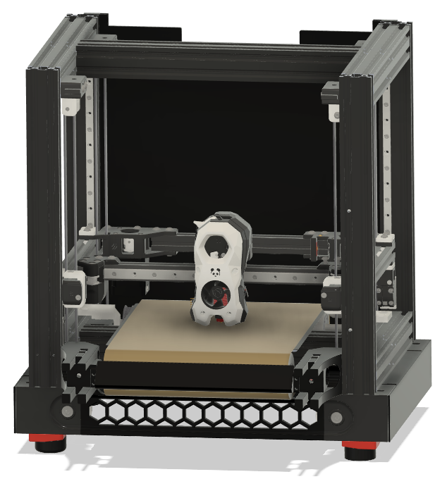
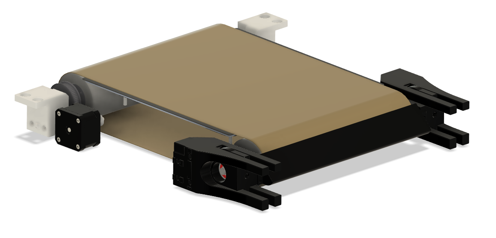
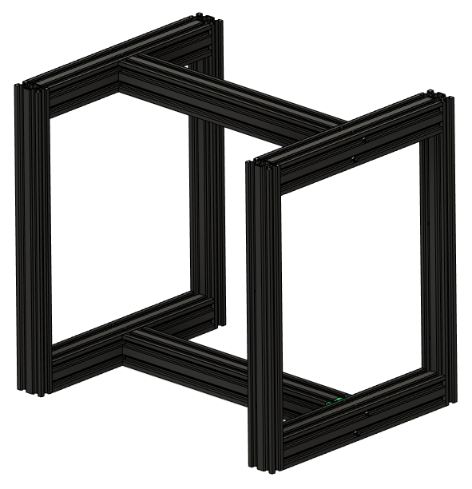
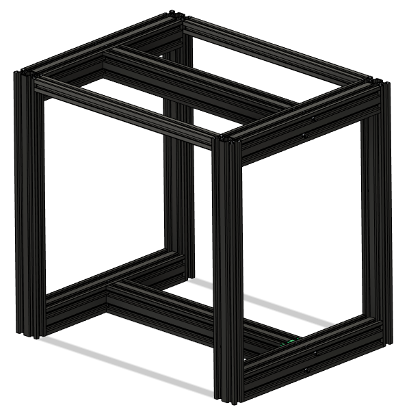
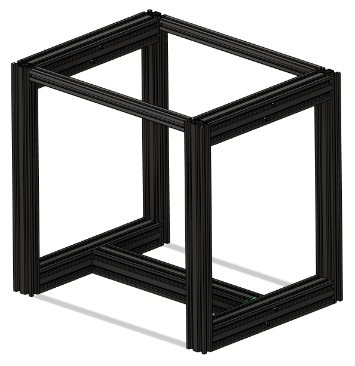

# Baby-Panda 🐼
#### CoreXY Continuous Printing

Baby Panda is a CoreXY printer with conveyor build plate to enable affordable high quality continuous printing. The motion system is based on the [Voron 2.4](https://vorondesign.com/voron2.4), with z motor mounts and skirts modified to accommodate the conveyor.  The design is intended to repurpose as many parts as possible from a pair of Ender 3s.

If you like this project, please consider <a href="https://www.ko-fi.com/robxberty">tipping</a>!
## Building Baby Panda
There are currently no build instructions specific to Baby Panda, so but the [Voron 2.4r2 assembly manual](https://github.com/VoronDesign/Voron-2/raw/Voron2.4/Manual/Assembly_Manual_2.4r2.pdf) can be used for the most part, along with the following reasources for the Baby Panda-specific parts:
* [BOM](https://github.com/robwaldhauser/Baby-Panda/blob/main/BOM%20Spreadsheet.ods) - Baby Panda bill of materials (.ods format)
* [STLs](https://github.com/robwaldhauser/Baby-Panda/tree/main/STLs) - model files for each part
* [CAD](https://github.com/robwaldhauser/Baby-Panda/tree/main/CAD) - An archive containing a .step file with a fully assembled Baby Panda

If you have any questions, or want to see pictures and videos of builds, check out the #🐼baby-panda channel in the [Build Biome Discord server](https://discord.gg/SpCVg9wG). 

## Ender 3 Parts Reuse
As mentioned above, one of the goals of this project is to repurpose parts from Ender 3s that are sitting around gathering dust. Some of the parts that can be reused include:
* All base 4040 extrusions (Pro/V2)
* Y 4040 extrusion (Pro\*)
* 4020 extrusions (Pro/V2)
* Power supply
* Mainboards\**
* Motors
* Bed carriage
* Heated bed
* Some wiring

\*V2 Y 4040 extrusion could be reused with spacers
\*\*A total of 8 motors drivers are needed, but if you have 2 mainboards they can both be used

## The Belt Assembly
This assembly is the heart of the project. It adds one additional stepper motor to the BOM. There is nothing official released yet, but several people in the Discord are working on macros to make it work. The purpose of the belt is to eject printed parts automatically after printing so that another job can run immediately and without intervention. It is not intended to move during a print as X-Y movement is handled by the coreXY motion system.

<em>Belt assembly</em>

## The Frame
The standard Baby Panda frame can be built entirely from extrusions salvaged from 2 Ender 3s. Ender 3 pro is ideal. 3V2 can work, but the Y extrusion is slightly shorter. This can be worked around using spacers or by buying a longer extrusion.

<em>Standard frame</em>

In the standard configuration, the 3 4040 extrusions from the base of one Ender form the base of the Baby Panda frame, and the base extrusions of the other Ender  form the top. The uprights from each ender, which will need to be drilled out for blind joints using the <a href="https://github.com/robwaldhauser/Baby-Panda/blob/main/STLs/Drilling%20Jig.stl">jig</a> available in the CAD section, connect the top of the frame to the bottom in each corner. In case you're not familiar with drilling/tapping new blind joints, <a href="https://www.youtube.com/watch?v=2dvbn0rWA60&ab_channel=CanuckCreator">this video</a> is really helpful. Optionally, 2 additional 2020 extrusions can be installed for extra rigidity and to help enclose the printer.

<em>A couple options for placement of additional 2020 extrusions</em>

